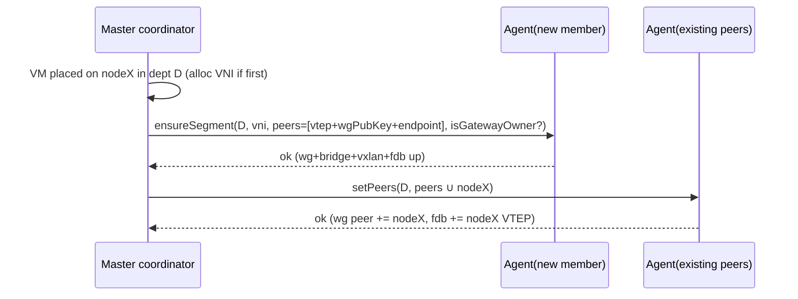

## Cluster Networking & Console

Today every department is a single Linux bridge `infinibr-{shortId}` on **one** host, created by `BridgeManager`, NAT'd by `DepartmentNatService`, served DHCP by a per-bridge `dnsmasq` (`Department.bridgeName/gatewayIP/dhcpRangeStart/dhcpRangeEnd/dnsmasqPid`, `prisma/schema.prisma:728-735`), filtered by per-VM bridge-family nftables chains (`NftablesService`), and every display binds loopback (`DEFAULT_SPICE_ADDR='127.0.0.1'`, `display.types.ts:36`). None of this survives a department spanning multiple nodes. This section makes an L2 segment node-spanning, keeps the existing firewall/NAT/DHCP semantics intact, makes consoles reachable through the master **with per-session, per-VM authorization**, and authenticates the overlay so a department's VNI is a real tenant boundary.

**Invariants we must preserve.** (1) The base forward chain stays `policy accept`; default-deny is per-VM terminal `drop` (`NftablesService.ts:1051-1066`) — overlay ports must never be jumped into a VM chain. (2) DHCP allow rules are scoped to `vnet-*` TAPs (`NftablesService.ts:1089`) — overlay interfaces must use a *different* name prefix so they are neither filtered as TAPs nor accepted as DHCP. (3) `VMMoveService` hot-swaps TAP→bridge + reapplies firewall (`VMMoveService.ts:172-199`); that contract is reused unchanged for same-host moves and extended for cross-host.

### 1. L2 overlay: authenticated VXLAN per department (VNI = department)

Each department gets one **VNI**. On every node that hosts ≥1 VM of that department, the Node Agent realizes the *same* `infinibr-{shortId}` bridge **locally** and enslaves a VXLAN netdev `infivx-{shortId}` to it. The bridge becomes a distributed L2 domain: a VM's TAP (`vnet-*`) and the VXLAN port share the bridge, so frames flood across the underlay to peer VTEPs.

```
node-A                          underlay (encrypted overlay net)       node-B
 vnet-aaa ─┐                                                    ┌─ vnet-bbb
           ├─ infinibr-7f3 ─ infivx-7f3 ==VNI 4711 over WG==  infivx-7f3 ─ infinibr-7f3 ─┤
 vnet-aac ─┘        │           (VXLAN inside WireGuard tunnel)        │       └─ vnet-bbd
                gatewayIP+dnsmasq (owner node only)              no gateway here
```

**The VNI alone is NOT a security boundary.** VXLAN/UDP-4789 is cleartext and unauthenticated: any host on the underlay can spoof a VTEP source IP, inject frames into an arbitrary VNI, or sniff decapsulated tenant traffic. `nolearning` + static FDB only fix the *control* plane (MAC flapping); they do nothing to filter spoofed *ingress*. We therefore **carry VXLAN inside a WireGuard mesh between VTEPs** (Decision ADR-N4). The master is the WireGuard control plane: it distributes each member's public key + endpoint as part of the peer set, and the VXLAN VTEP `local`/FDB `dst` addresses become the *WireGuard interface* addresses, not raw underlay IPs. A compromised node can now only forge frames into VNIs it is *already a member of* (i.e. departments it already runs VMs for), because WireGuard drops any packet not signed by an enrolled peer key. Cross-tenant injection requires the peer private key, which never leaves the node that owns it and is rotated on node lifecycle events (join / re-key / decommission).

Data-model additions (master is source of truth; agents are told, they don't allocate). `NodeUnderlay` is added to the **Data-Model** schema block (owner: Data-Model); this section only defines its shape and consumers:

```prisma
model Department {
  // ...existing bridgeName/gatewayIP/dhcpRange*/dnsmasqPid...
  vni              Int?     @unique           // 4096..16M; allocated by master on first cross-node need
  overlayMode      String   @default("local") // "local" (single-host) | "vxlan"
  gatewayNodeId    String?                    // node that owns gatewayIP + runs dnsmasq (anycast-of-1)
  overlayMtu       Int      @default(1370)    // 1500 - 50 VXLAN - 80 WireGuard headroom
}

model NodeUnderlay {                          // VTEP + WG identity per node
  nodeId      String @id
  vtepIp      String                          // overlay/VM-data NIC IP (or mgmtIp on single-NIC nodes)
  wgPubKey    String                          // WireGuard public key; private key never leaves the node
  wgEndpoint  String                          // host:port the peer dials for the WG tunnel
  updatedAt   DateTime @updatedAt
}
```

**Who populates `NodeUnderlay`.** Onboarding owns it. The `JoinRequest` hardware payload (owner: *Node onboarding*) carries the candidate data-NIC IP and the agent-generated WireGuard public key; the master persists `NodeUnderlay` at approve time. For single-NIC nodes the agent reports `vtepIp == mgmtIp` and the master defaults it so. If the data NIC is reconfigured, the agent re-reports `vtepIp/wgEndpoint` on its next lease renewal (see §6 heartbeat) and the master updates the row, triggering a `setPeers` fan-out. This closes the "declared by Networking, set by nobody" gap.

VTEP membership is **head-end replication with static unicast FDB** (no multicast assumption, no BGP-EVPN daemon). The master computes, per department, the set of member nodes and pushes the peer set (VTEP IP + WG pubkey + endpoint) to each member agent.

Node Agent network RPC (rides the agent mTLS transport; server-side authorized to the agent's own `nodeId` — see *Node Agent & RPC*):

```ts
interface OverlayPeer { nodeId: string; vtepIp: string; wgPubKey: string; wgEndpoint: string; }

interface OverlayRPC {
  ensureSegment(s: {
    deptId: string; bridgeName: string; vni: number; mtu: number;
    isGatewayOwner: boolean; gatewayCidr?: string;          // "10.10.100.1/24" only on owner
    peers: OverlayPeer[];
  }): Promise<void>;                                         // idempotent reconcile of WG+bridge+vxlan+FDB
  setPeers(deptId: string, peers: OverlayPeer[]): Promise<void>;
  destroySegment(deptId: string): Promise<void>;            // when node hosts 0 VMs of dept
}
```

`ensureSegment` reconciles via existing primitives plus WireGuard + `ip` calls behind the same `CommandExecutor`/`BridgeManager` seam:

```
# 1. WG mesh (idempotent): one wg interface per overlay, peers keyed by pubkey
wg set infiwg pubkey <self> ... ; for p in peers: wg set infiwg peer <p.wgPubKey> endpoint <p.wgEndpoint> allowed-ips <p.vtepIp>/32
# 2. VXLAN bound to the WG-reachable VTEP addresses
ip link add infivx-7f3 type vxlan id 4711 dstport 4789 local <self.vtepIp> nolearning
ip link set infivx-7f3 mtu 1370 up
BridgeManager.addInterface('infinibr-7f3','infivx-7f3')      # reuse :157
for p in peers: bridge fdb append 00:00:00:00:00:00 dev infivx-7f3 dst <p.vtepIp>   # head-end replication
```

Adding/removing a node from a department is a `setPeers` fan-out — O(N) `wg set` + `bridge fdb` deltas, no bridge teardown.



### 2. Firewall interaction (NftablesService)

The overlay is **transparent** to per-VM filtering: chains match the VM's `vnet-*` `iifname`/`oifname` (`NftablesService.ts:1154-1157`), unchanged — a frame arriving via VXLAN egresses the bridge onto the destination TAP and is filtered there exactly as a local frame. Guardrails:

- **Naming:** overlay netdev prefix `infivx-`/`infiwg` deliberately ≠ `vnet-` (`TAP_NAME_PREFIX`, `network.types.ts:12`) so the `vnet-*` DHCP wildcard (`NftablesService.ts:1089`) and any TAP reconcile (`TapDeviceManager`) never touch them.
- **No jump for the overlay port:** the base forward chain only jumps `vnet-*`→VM-chains; the VXLAN/WG ports are never jump targets — single enforcement point at the destination TAP, no double-drop.
- **Underlay ingress filter (defense in depth):** even with WireGuard, the agent installs an inet ingress rule on the data NIC accepting UDP/4789 and the WG port **only from enrolled peer endpoints**, drop otherwise. On a dedicated underlay VLAN this is the primary control; with WG it is belt-and-suspenders.
- **NAT singularity:** `DepartmentNatService` masquerade runs **only on `gatewayNodeId`**; non-owner members skip masquerade for that dept (else east-west double-NATs).
- **Conntrack:** the established/related rule needs `nf_conntrack_bridge` (`NftablesService.ts:218-274`) — now a **per-node** preflight; a node whose probe failed surfaces as `degraded` in inventory.

### 3. IPAM & DHCP across nodes

**Master is IPAM, exactly one node runs DHCP.**

- **Allocation (master):** at VM create, master allocates `Machine.localIP` from the dept CIDR (`localIP/publicIP` already exist) and records the MAC — no races between independent `dnsmasq` instances.
- **Serving (gateway-owner node):** only `gatewayNodeId` holds `gatewayIP` (`BridgeManager.assignIP`, `:242`) and runs `dnsmasq`, reachable from every member over the overlay. Master pushes **static reservations** so leases are deterministic regardless of node:

```ts
ensureDhcp(d: { deptId: string; bridge: string; rangeStart: string; rangeEnd: string;
  gatewayCidr: string; dns: string[]; ntp: string[]; mtu: number;
  reservations: { mac: string; ip: string; name: string }[] }): Promise<{ pid: number }>;
```

`Department.dnsmasqPid` becomes owner-node-scoped. **DHCP relay is avoided** — BUM frames flood the VNI to the owner via head-end FDB, so a guest `DHCPDISCOVER` reaches the owner's `dnsmasq` natively. The `vnet-*`-scoped DHCP accept rule (`NftablesService.ts:1110-1134`) must exist on **every** member (the request ingresses a local TAP before crossing the overlay).

### 4. Department move & cross-host interaction with VMMoveService

`VMMoveService.moveVMToDepartment` (`VMMoveService.ts:67`) stays the canonical "dept change = bridge + TAP + firewall reapply" path.

- **Same host:** unchanged — `detachFromBridge`/`attachToBridge` + `applyVMRules` (`:177-192`), targeting the *local* realization of the new dept's overlay bridge (agent `ensureSegment`s first).
- **Cross host (move + node migration):** decomposed — the *node-migration* subsystem relocates the VM; this subsystem's contract: *before* the VM starts on the target, `ensureSegment(newDept)` there and `setPeers` the mesh; *after* source teardown, if the source now hosts 0 VMs of old/new dept, `destroySegment`. Rollback mirrors the reverse-order unwind (`VMMoveService.ts:239-310`): drop the new VTEP/WG peer, reattach the TAP to the old bridge.
- **Per-VM HMAC key on migration (cross-ref):** the destination node needs the migrated VM's per-VM `infiniservice` HMAC key. Per *Deployment-Installer §8* and ADR-S3, the fleet master secret `INFINISERVICE_HMAC_MASTER_SECRET` **never lands on a node**; the master derives `HMAC(master, vmId)` and ships **only that per-VM key** over the authenticated mTLS RPC to the node(s) currently hosting the VM, including the destination JIT at migration. This section's `ensureSegment`/move handshake carries no secret material; key delivery is owned by *Security-RBAC / agent provisioning*, which we require to use the JIT per-VM model so a compromised node's blast radius stays its own VMs.

### 5. Console / display routing + authenticated gateway

Today the console URL is built from `graphicHost = configuration.graphicHost || GRAPHIC_HOST || 'localhost'` (`machine/resolver.ts:54,93`) and the display binds `APP_HOST||127.0.0.1` (`CreateMachineServiceV2.ts:455`). In a cluster the display lives on an arbitrary node and must be neither world-reachable nor reachable by the wrong tenant.

**Bind:** display binds the node's **management IP** (not loopback, not `0.0.0.0`), preserving the secure-by-default ticket model (`display.types.ts:27-36`). **QMP ticket:** minted on demand, single-use, short-lived via `set_password`+`expire_password` — never persisted as `graphicPassword`. The QMP ticket only protects the **node↔gateway** hop; it is *not* the browser authorization secret.

**Authorization model (closes console-hijack + IDOR).** Three independent checks; the sessionToken is **never in the URL path**:

1. **`getConsoleSession(vmId)` (GraphQL, user JWT):** the resolver loads the VM, resolves its `departmentId`, and enforces `vm:view` via `scopeCovers(user, vm.departmentId)` — the same department-scope check used elsewhere. A user requesting an out-of-scope `vmId` is denied here, killing the cross-tenant IDOR. Only on success does the master call the agent's `getConsoleInfo(vmId)`.
2. **Single-use sessionToken bound server-side:** the master persists the session in Postgres (so any replica can serve it — see ADR-N3) keyed to `{userId, vmId, nodeId, port, ticket}`, returns a token **out of band** and a path-less WS URL `wss://master/console`.
3. **WS upgrade carries BOTH the user JWT AND the sessionToken out-of-URL** (via `Sec-WebSocket-Protocol` subprotocol values, since browsers can't set arbitrary WS headers). On upgrade the gateway: validates the JWT → `userId`; looks up the sessionToken row; asserts `row.userId === userId`, not expired, `used === false`, then atomically marks it `used` (single-use); **re-runs `scopeCovers(user, row.vmId)`** as defense-in-depth; only then dials the node. Anyone replaying a leaked token without the matching JWT, or after first use, is rejected.

```prisma
model ConsoleSession {
  sessionToken String   @id          // opaque, 256-bit; passed via WS subprotocol, never in URL
  userId       String
  vmId         String
  nodeId       String
  port         Int
  ticket       String                // QMP node↔gateway ticket
  expiresAt    DateTime              // short TTL (e.g. 30s to upgrade)
  usedAt       DateTime?             // set on first WS upgrade -> single-use
}
```

```ts
interface ConsoleInfo {
  protocol: 'spice' | 'vnc';
  nodeMgmtHost: string;   // node management-plane IP
  port: number;           // 5900+ on that node
  ticket: string;         // per-session QMP ticket (node<->gateway only)
  ticketExpiresAt: string;
}
// Agent: getConsoleInfo(vmId) -> QMP set_password(ticket); expire_password("+120"); return ConsoleInfo
```

```mermaid
sequenceDiagram
  participant FE as Frontend (user JWT)
  participant LB as LB
  participant GW as Console proxy tier (worker)
  participant M as Master GraphQL replica
  participant Ag as Node Agent
  FE->>M: getConsoleSession(vmId)  [JWT]
  M->>M: scopeCovers(user, vm.dept) + vm:view  (deny => IDOR blocked)
  M->>Ag: getConsoleInfo(vmId)  (mTLS, mgmt plane)
  Ag->>Ag: QMP set_password(ticket)+expire
  Ag-->>M: {nodeMgmtHost,port,ticket,exp}
  M->>M: INSERT ConsoleSession{token,userId,vmId,node,port,ticket,exp}
  M-->>FE: { wss://master/console , sessionToken }
  FE->>LB: WS upgrade  (subproto: jwt + sessionToken)  -- token NOT in path
  LB->>GW: route to any proxy worker
  GW->>GW: verify JWT==row.userId, unused, unexpired -> mark used; scopeCovers recheck
  GW->>Ag: dial mgmt:port over mTLS, send QMP ticket
  GW-->>FE: bridged SPICE/VNC stream
```

**Statefulness & scale (closes affinity + throughput findings).** ADR-N3's "stateless per-session" claim is made real by **externalizing the session map to Postgres** (`ConsoleSession`), so *any* replica/worker can serve the follow-up WS — the LB needs no sticky routing keyed on a token it can't read. The proxy is **not** the GraphQL event loop: console workers are a **dedicated, horizontally-scaled tier** (own process/pool, own LB target), so a console burst of multi-Mbps binary streams cannot stall the API. Each worker advertises a **max concurrent-session cap**; the master refuses new `getConsoleSession` when the tier is saturated and surfaces it as backpressure. Throughput scales by adding workers; correctness is independent of which worker lands the WS because state lives in Postgres. Sessions are TTL-bounded and **revoked on VM stop/migrate** (delete the row + `expire_password` on the node). `getConsoleInfo` replaces the `graphicHost` field at its producers (`machine/resolver.ts:54,93,94,210,219`); the frontend swaps `spice://host:port` for the path-less `wss://` URL + subprotocol token.

### 6. Management vs VM-traffic separation

Three logical planes, ideally on separate NICs/VLANs:

| Plane | Carries | Bind |
|------|---------|------|
| **Management** | agent mTLS RPC, **lease-renewal heartbeat**, **console gateway↔node**, IPAM pushes, per-VM HMAC key delivery | node mgmt IP |
| **Overlay/data** | WireGuard tunnel + VXLAN VTEP (UDP 4789), east-west VM L2 | `NodeUnderlay.vtepIp` |
| **Guest L3 egress** | masqueraded internet from `gatewayNodeId` | dept gateway uplink |

Keeping console + RPC on management means a saturated overlay never starves control or freezes consoles, and the VTEP underlay can run jumbo frames to amortize the VXLAN+WG MTU tax without touching mgmt. **Single-NIC nodes** collapse all three onto one interface (`vtepIp == mgmtIp`). In that collapsed-plane case the WireGuard overlay is still authenticated/encrypted, but the dedicated-underlay-VLAN ingress filter no longer isolates planes; this is flagged as a **non-isolated, residual-risk deployment** in inventory and the admin is warned before placing security-sensitive departments there.

**Heartbeat / liveness (cross-ref, owner: *Control-Plane / Observability-Ops*).** Liveness is **agent-push lease renewal**, not master-pull — the agent self-fences when it cannot RENEW its lease before `AGENT_SELFFENCE_AT < MASTER_DECLARE_DEAD`, which is the cornerstone of the no-double-write/anti-split-brain proof. This section consumes that model: each lease renewal is bound to the agent's **mTLS cert identity** and carries `nodeId` + `vms[]` + current `vtepIp/wgEndpoint`, so the master's membership/FDB recompute and `NodeUnderlay` updates derive from an authenticated source. A wedged agent that stops renewing is fenced by a hardware/softdog watchdog. Our failure-mode table below references "lease renewal" accordingly; the inequality and watchdog are owned by Control-Plane (rewrite their §7/ADR-CP4 to this agent-push model).

### ADRs

**ADR-N1 — VXLAN + static-unicast FDB, master as controller.**
*Decision:* per-department VNI, head-end replication via `bridge fdb` entries the master distributes. *Rationale:* reuses `BridgeManager`/`CommandExecutor`, no new daemon, no multicast, master holds membership truth. *Alternatives rejected:* multicast VXLAN (enterprise LANs block IGMP/PIM); BGP-EVPN/FRR (operational weight unjustified); GENEVE/OVS (replaces the bridge stack). *Consequences:* O(N²) FDB state, refreshed on membership change; master is the overlay control plane (idempotent reconcile).

**ADR-N2 — Single gateway-owner node per department.**
*Decision:* one node holds `gatewayIP` + `dnsmasq` + masquerade; master is IPAM. *Rationale:* eliminates dual-DHCP/dual-NAT races on shared L2; deterministic leases. *Alternatives rejected:* anycast gateway everywhere (asymmetric-routing/conntrack hazards); distributed dnsmasq with disjoint ranges. *Consequences:* gateway-owner is a per-dept failure domain → owner reassignment + `dnsmasq` re-spawn is defined recovery; east-west works gateway-down.

**ADR-N3 — Master console gateway: node-mgmt bind, externalized session state, dedicated proxy tier, three-factor authz.**
*Decision:* displays bind mgmt IP; the browser reaches them only via a master WS proxy. Authorization requires (user JWT ∧ single-use out-of-URL sessionToken bound to `{userId,vmId,ticket}` ∧ `scopeCovers(vmId)` at both `getConsoleSession` and WS-upgrade). Session map is persisted in Postgres (`ConsoleSession`); the proxy runs as a dedicated horizontally-scaled worker tier separate from GraphQL replicas, with a per-worker concurrency cap. *Rationale:* no console is internet/LAN-exposed; URL-leak/replay/IDOR are all closed because the only authz secret is never in the URL and is single-use + JWT-bound; any replica/worker can serve the WS because state is in Postgres (no sticky-routing requirement on the LB); console bursts can't stall the API. *Alternatives rejected:* token-in-URL-path (leaks via logs/Referer/history); in-memory per-replica session map + LB token-stickiness (LB can't read a subprotocol token; brittle); proxying on the GraphQL event loop (CPU-bound, head-of-line blocks the API); direct `spice://node:port` (exposes every node, no central authz). *Consequences:* the master is on the console data path → scale the proxy tier and cap sessions; **Deployment must provision the console-proxy tier as a distinct LB target** and run Postgres-backed session state.

**ADR-N4 — Authenticated/encrypted overlay (WireGuard between VTEPs).**
*Decision:* VXLAN runs inside a WireGuard mesh; the master distributes peer pubkeys/endpoints with the peer set and rotates keys on node lifecycle. An underlay ingress filter additionally restricts UDP/4789 + WG to enrolled peers. *Rationale:* raw VXLAN is cleartext/unauthenticated — VTEP spoofing lets any underlay host inject into or sniff any VNI, breaking the "department = VNI = isolation" claim that *Security-RBAC §5* delegates here. WG gives per-peer authentication + encryption so a node can only reach VNIs it is already a member of; its private key never leaves the host. *Alternatives rejected:* IPsec transport (heavier keying/IKE, more moving parts at this scale); plain dedicated underlay VLAN only (sufficient on isolated fabrics but offers no protection against a compromised *member* node and none for single-NIC/collapsed-plane); MACsec (NIC/switch dependent). *Consequences:* ~80B WG overhead → `overlayMtu` default 1370 or jumbo underlay; master is the WG control plane (key/endpoint distribution + rotation is part of `setPeers`); **residual risk** on single-NIC collapsed-plane nodes where planes aren't physically separated — flagged in inventory.

### Failure modes & recovery

| Failure | Effect | Recovery |
|--------|--------|----------|
| Peer VTEP unreachable | east-west to that node's VMs blackholes | lease-renewal lapse marks node offline → master `setPeers` drops it from every dept mesh (WG peer + FDB); self-heals on rejoin |
| Stale FDB / WG peer after silent node loss | flooding/keying to a dead VTEP | reconcile loop diffs `NodeUnderlay` + live membership each lease renewal; prunes orphan FDB + WG peers |
| Compromised member spoofs another VNI | attempted cross-tenant injection | WG drops frames not signed by an enrolled peer key for that overlay; ingress filter drops non-peer UDP/4789 |
| `gatewayNodeId` down | no new DHCP leases / no NAT egress for dept | master elects new owner → `ensureSegment(isGatewayOwner)` + `ensureDhcp` with same reservations; old `gatewayIP` released on recovery |
| MTU mismatch (guest 1500 over overlay) | large-packet drops, "works for ping" | enforce `overlayMtu` on bridge+vxlan; advertise via `dnsmasq` option-26; surface mismatch in node health |
| Console sessionToken leak (logs/Referer) | replay attempt against gateway | token never in URL; single-use + short TTL + JWT-bound; first WS upgrade marks `usedAt`; replay without matching JWT or after use rejected; revoked on stop/migrate |
| Cross-tenant console request (IDOR) | user requests foreign `vmId` | denied at `getConsoleSession` via `scopeCovers`+`vm:view`, re-checked at WS upgrade |
| Console worker saturated | new sessions can't proxy | per-worker cap; master returns backpressure; add workers (Postgres-backed state, no affinity needed) |
| VNI collision / exhaustion | two depts share L2 | `vni @unique` at DB; allocator skips reserved ranges; alarm on pool exhaustion |
| Overlay netdev named `vnet-*` by mistake | filtered/DHCP-accepted as a TAP | hard-enforced `infivx-`/`infiwg` prefix + assertion in `ensureSegment` |

**Dependencies on other subsystems (referenced, not designed here):** *Node Agent & RPC* owns the mTLS transport these `OverlayRPC`/`getConsoleInfo` calls ride and the cert-bound lease-renewal heartbeat; *Control-Plane / Observability-Ops* owns the agent-push lease/self-fence inequality + watchdog (ADR-CP4 must adopt the agent-push model); *Node onboarding* carries the candidate `vtepIp`+`wgPubKey`+`wgEndpoint` in `JoinRequest` and persists `NodeUnderlay`; *Data-Model* hosts the `NodeUnderlay`/`ConsoleSession` schema; *Security-RBAC / agent provisioning* must ship only the per-VM derived HMAC key JIT over mTLS (never `INFINISERVICE_HMAC_MASTER_SECRET` to a node); *Deployment* must stand up the console-proxy tier as a distinct LB target with Postgres-backed session state; *infinization node-scoping (G0)* must land first so a node only reconciles its own bridges/TAPs/overlay netdevs and never reaps a peer's.
